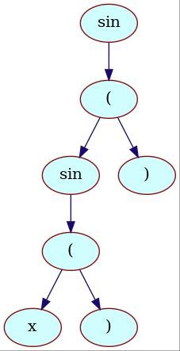
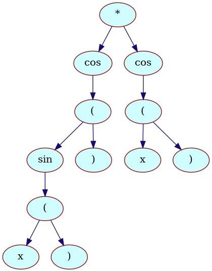

# Project description

The `diff` program reads arithmetic expression from file, creates Abstract Syntax Tree from it, 
and then differentiates it, producing  `.tex` output file.

# Examples




# Building and running
To build project, follow instructions:
```shell
make diff
./diff
```
Expression is stored in `expression.txt` file.

